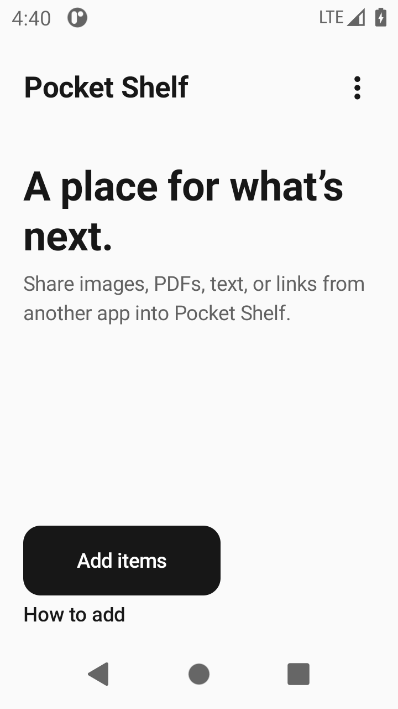
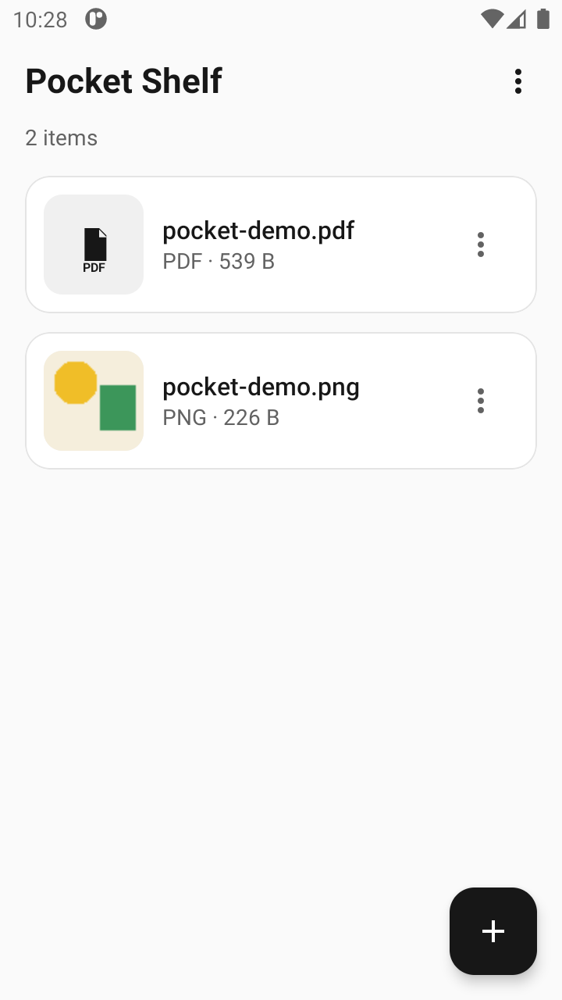
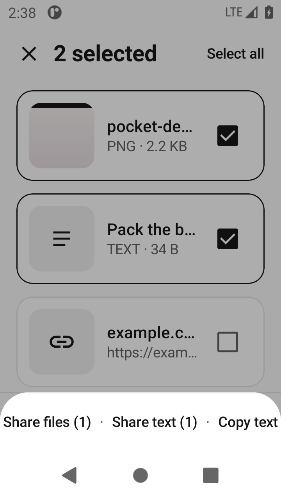

# Pocket

**Collect now. Share when you're ready.**

Pocket is a temporary tray on Android. A floating bubble sits over other apps. Share images, PDFs, notes, and links in; Pocket keeps its own copy on this device; share that copy out when you know where it’s going.

No account. No server. The app does not request the `INTERNET` permission.

[](https://github.com/ShobhanKarthish/pocket/actions/workflows/ci.yml)
[](LICENSE)

<p align="center">
  
  
  
</p>

<p align="center"><sub>Shelf stills from the running app. There is no in-repo screenshot of the bubble yet.</sub></p>

## Install

Android **8.0** or newer (API 26). Sideload from [Releases](https://github.com/ShobhanKarthish/pocket/releases) once a `vX.Y.Z` tag has been published, or build locally.

You need **JDK 17+** and Android SDK **platform 35**.

```bash
export JAVA_HOME=/path/to/jdk-17
export ANDROID_HOME=/path/to/android-sdk
./gradlew :app:assembleDebug
adb install -r app/build/outputs/apk/debug/app-debug.apk
```

Unit tests:

```bash
./gradlew :app:testDebugUnitTest
```

`scripts/verify-debug.sh` runs those tests, builds the debug APK, and fails if `INTERNET` leaked into it.

## Overlay permission

The bubble needs **Display over other apps**. Pocket asks on first launch. Without it, the shelf still works from the Pocket app and from **Share → Pocket**; Settings can turn the bubble on later.

Android may also ask to post a notification. That notification is only so the bubble’s foreground service can stay up while you use other apps.

## How to use

1. **Add items** with **Share → Pocket** from Photos, Files, a browser, or any other app. That is the reliable path. You can also tap **Add** on the shelf to pick files or write a note.
2. Pocket **copies** the payload into its own storage while the share grant is still valid. The original in the other app is never modified.
3. Tap the **bubble** for tray actions: open the shelf, share everything, clear, or hide. Drag it; it snaps to an edge.
4. On the shelf, open an item, select several, arrange order, then **Share** or **Remove**. Mixed files and text are offered as separate actions so nothing is dropped silently.

Cross-app drag-and-drop onto the overlay is **unreliable** on Android. Many apps never start a global drag, and some versions never deliver drops to overlay windows. If a drop does not land, use **Share → Pocket**. Pocket does not use Accessibility to watch other apps.

## Privacy

- Copies live in Pocket’s app storage on this device.
- There is no account and no server.
- `INTERNET` is removed in the manifest (`tools:node="remove"`). CI checks the built APK.
- **Display over other apps** is only used to show the bubble.
- Removing an item deletes Pocket’s copy only.

## Releases

App versions live in `gradle.properties` as `VERSION_NAME` and `VERSION_CODE`, and are wired into the Android module. Git tags are `v` plus `VERSION_NAME`.

After merging a version bump and [CHANGELOG](CHANGELOG.md) entry to `main`:

```bash
git tag vX.Y.Z
git push --tags
```

That tag must match `VERSION_NAME` (for example `v0.2.0`). GitHub Actions then creates a GitHub Release and attaches a debug APK (sideloadable) plus a release APK when the unsigned package builds. These are not Play Store–signed.

Current app version: **0.2.0** (`versionCode` 2). Tag `v0.2.0` on `main` to publish the first versioned GitHub Release. Older `debug-*` tags are ad-hoc APK drops, not versioned releases.

## License

[MIT](LICENSE)
